<div align="center">
    
</div>

<p align="justify">
  <b>Pindorama</b> é uma aplicação web para difundir conteúdos sobre o Patrimônio Cultural Imaterial Brasileiro. Você pode acessar artigos informativos, eventos, galeria de fotos e um mapa interativo para explorar a cultura do Brasil de uma forma que nunca viu antes!
  
  O site está disponível em: https://pindorama-cultura.vercel.app/  
</p>

<div align="center">
    
    
    
</div>

<br>

## Artefatos (documentação) de Experiência do Usuário (UX)

- [Criação de Persona](docs/ux-criacao-persona-pindorama.pdf)
- [Pesquisa de satisfação](docs/ux-pesquisa-satisfacao-pindorama.pdf)
- [Plano de suporte contínuo](docs/ux-plano-suporte-continuo-pindorama.pdf)

<br>  

## Screenshots (principais telas)

<div align="center">
  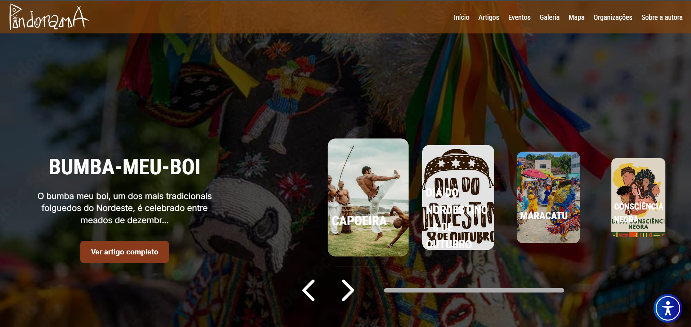
  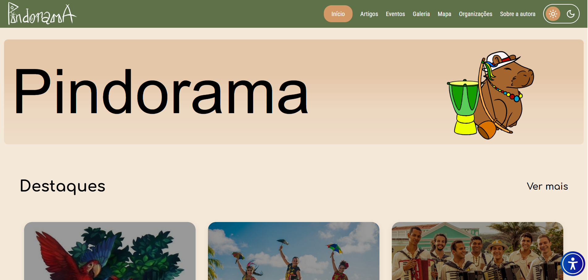
  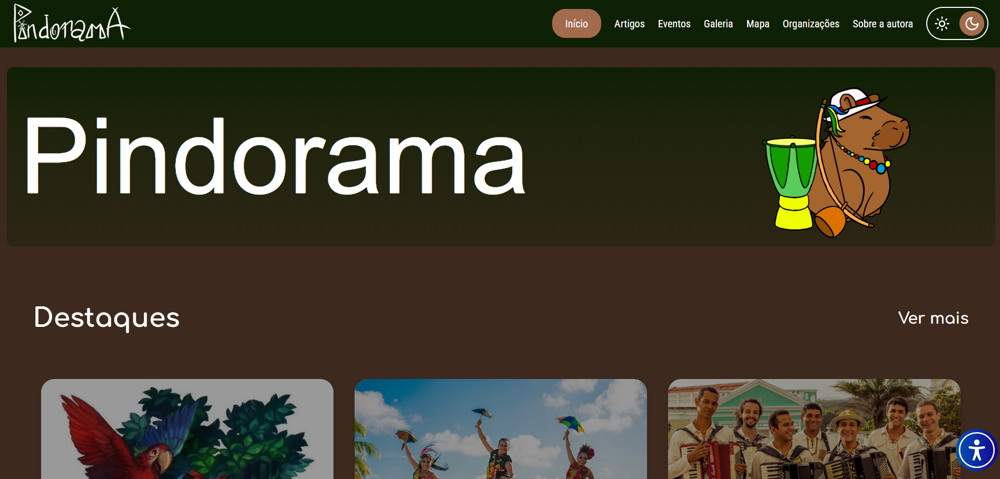
  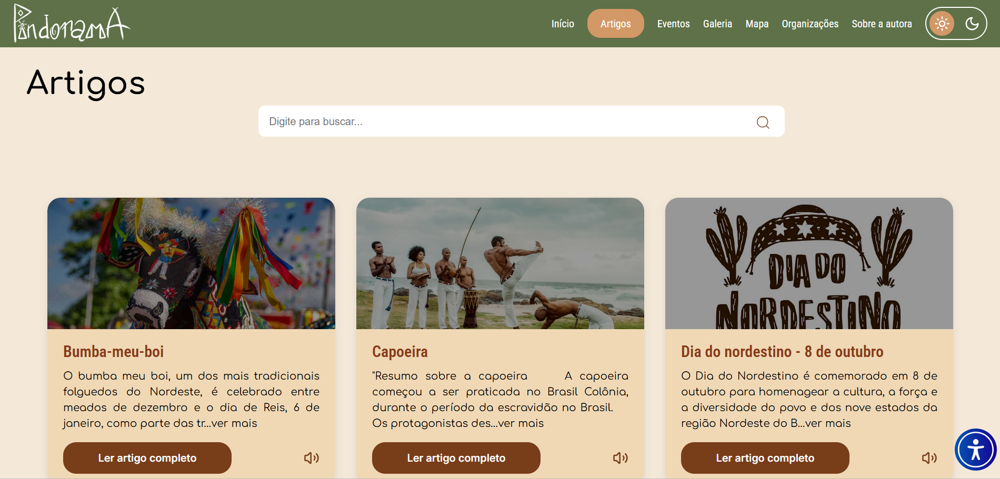
  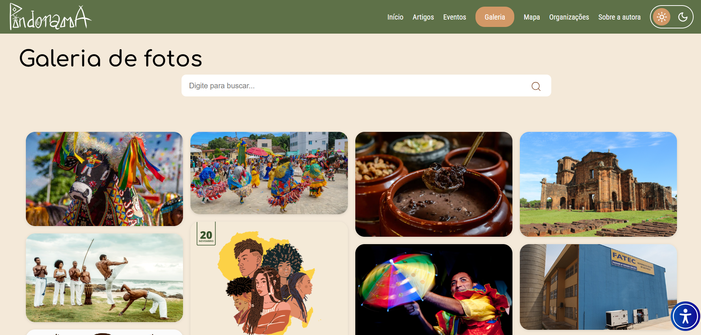
  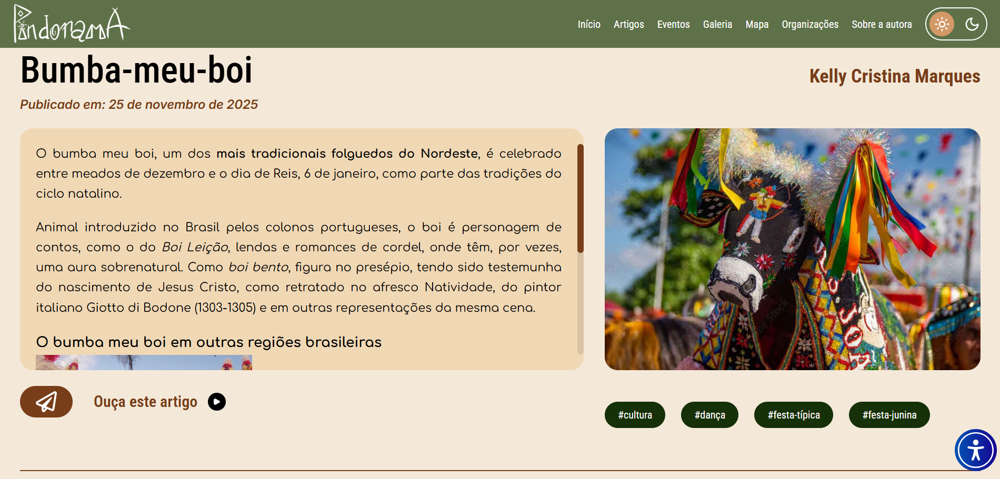
  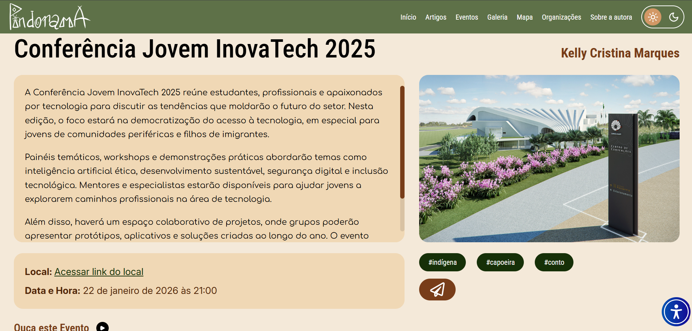
  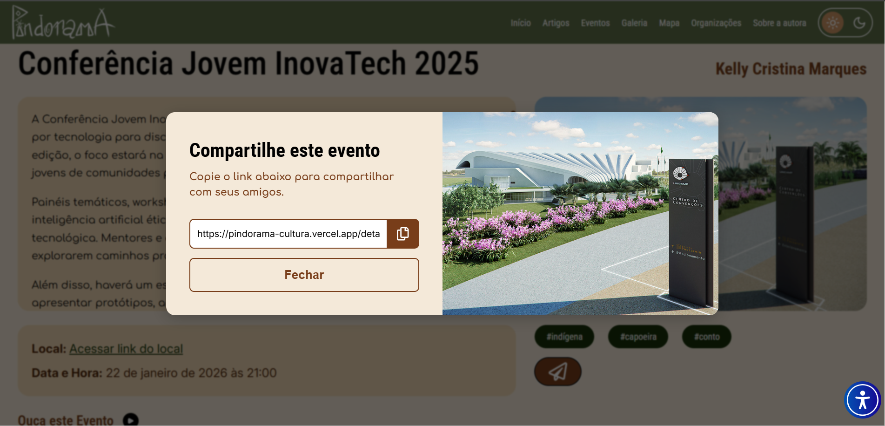
  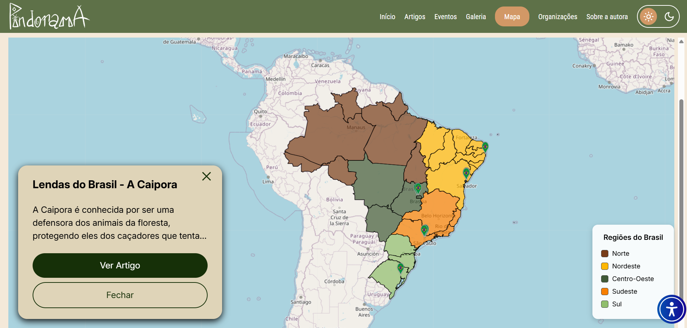
  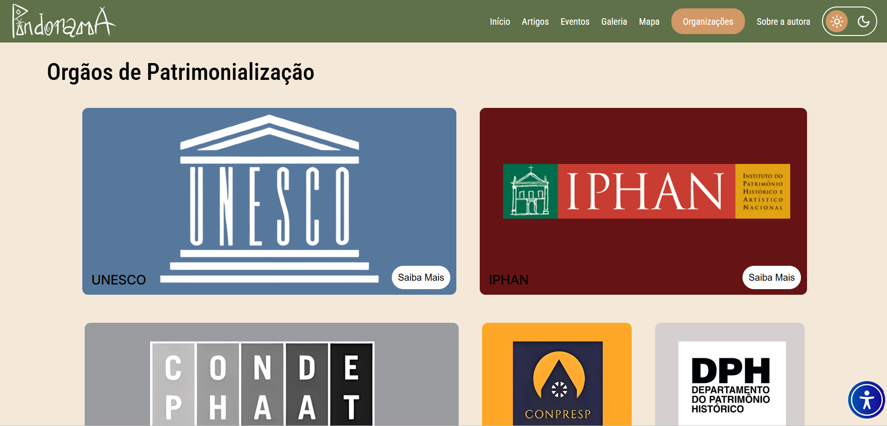
  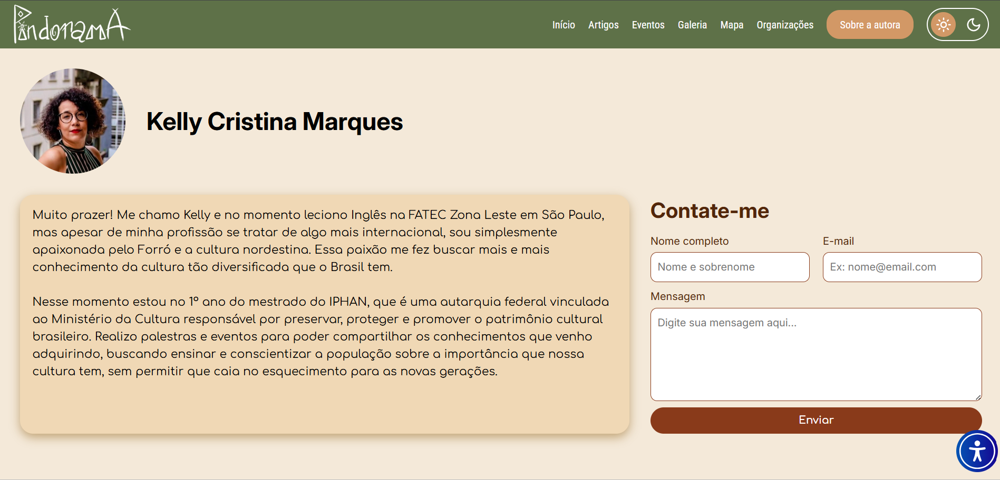
  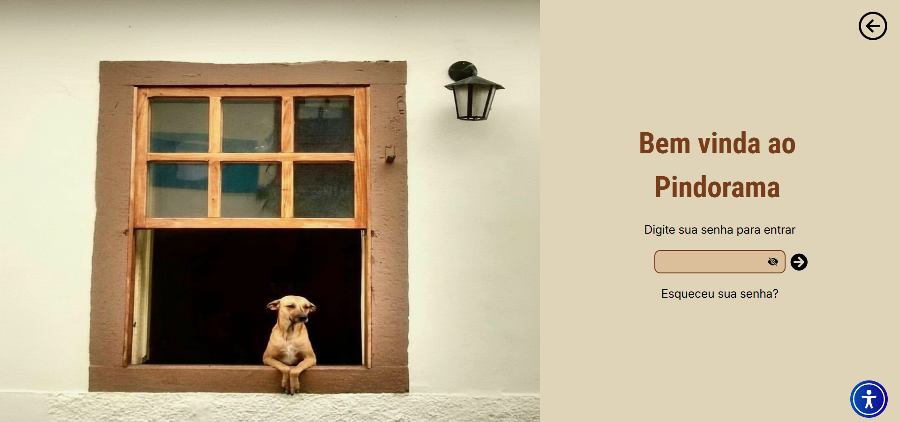
  
  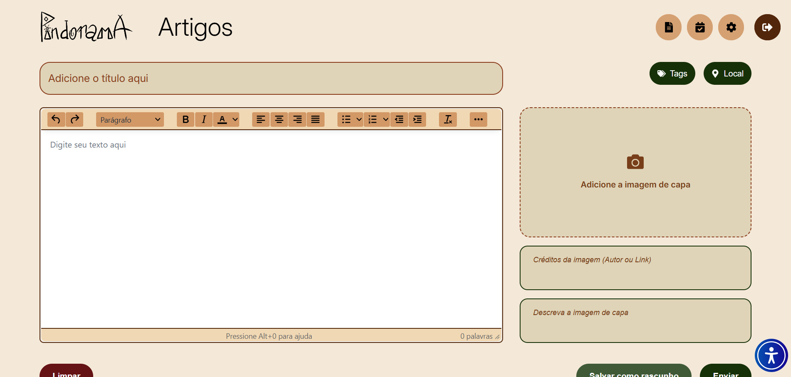
  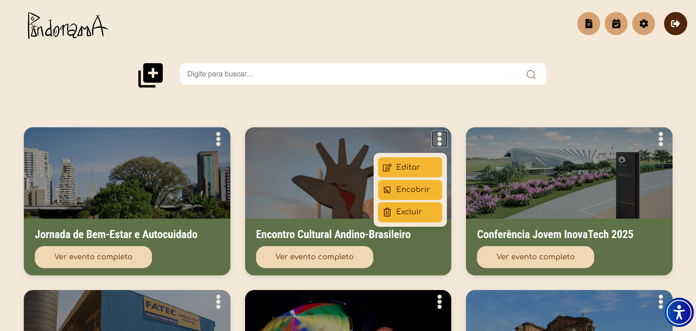
  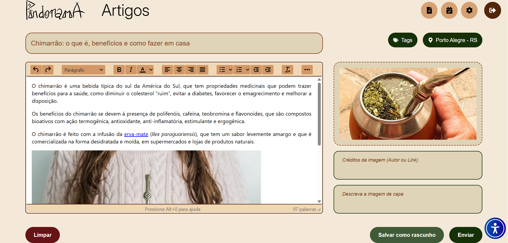
  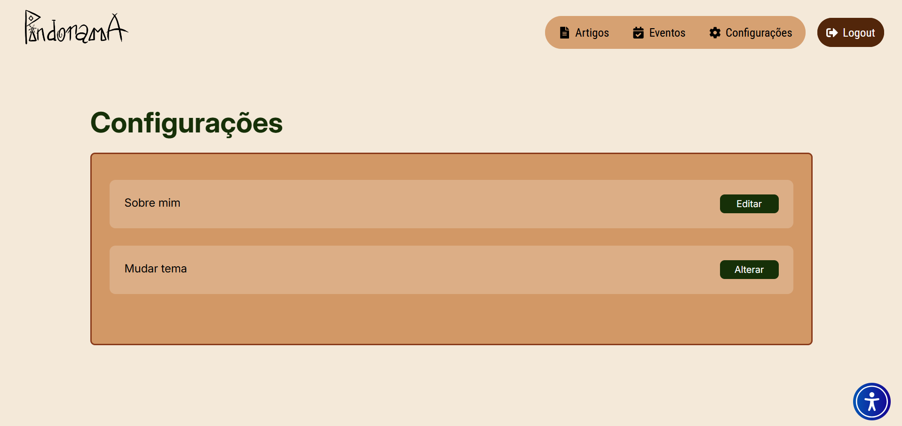
  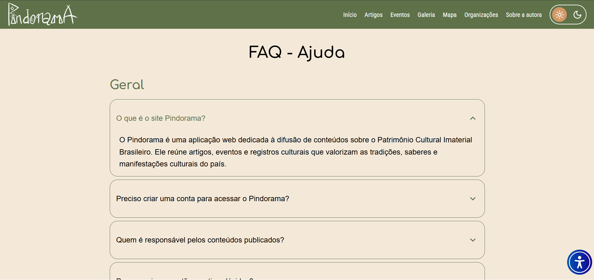
  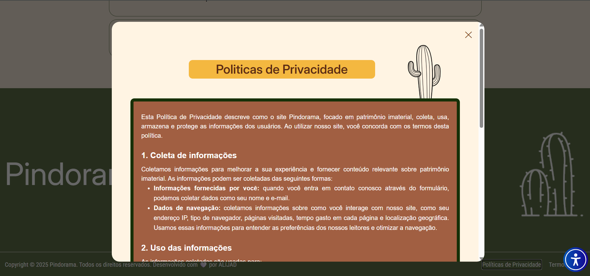
  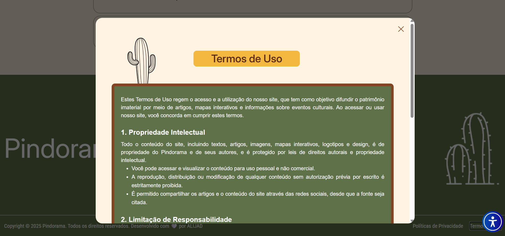
</div>

<br>

## Paleta de cores


<br>

## Stacks utilizadas

**Front-end:** 


**Back-end:** 


**Ilustrações:** 

**Documentação e versionamento:** 


<br>

## Requisitos funcionais

### Administrador

- CRUD de artigos e eventos
- Criar rascunhos
- Personalizar site em datas comemorativas
- Destacar eventos e datas especiais

### Usuário

- Acessibilidade
- Visualizar conteúdos
- Busca e filtros
- Interação via mapa do Brasil

## Requisitos não funcionais

- Conteúdo centralizado e acessível
- Interface simples e intuitiva
- Fácil atualização pelo administrador
- Escalabilidade para novas funções
- Textos claros, fontes legíveis e contraste adequado
- Informações resumidas
- Carregamento rápido
- Responsividade

<br>

## Instalação

Clone o projeto

```bash
  git clone https://github.com/Debora-Carvalho/sistema-web-pindorama.git
```

Entre no diretório do projeto

```bash
  cd sistema-web-pindorama
```

Instale as dependências

```bash

  npm install
```

Inicie o servidor

```bash
  npm run dev
```

<br>

## 📄 Licença

Este projeto está protegido. Para mais detalhes, consulte o arquivo [LICENSE](LICENSE.txt) na raiz do repositório.

<br>

## Desenvolvedoras

| Amanda Brito                                                                                                                                                                                                                                                      | Anahi Narieli                                                                                                                                                                                                                                                    | Débora Carvalho                                                                                                                                                                                                                                                       | Isabella Gonçalves                                                                                                                                                                                                                                                      | Julia Bongiovani                                                                                                                                                                                                                                            | Luna Leão                                                                                                                                                                                                                                                     |
| ----------------------------------------------------------------------------------------------------------------------------------------------------------------------------------------------------------------------------------------------------------------- | ---------------------------------------------------------------------------------------------------------------------------------------------------------------------------------------------------------------------------------------------------------------- | --------------------------------------------------------------------------------------------------------------------------------------------------------------------------------------------------------------------------------------------------------------------- | ----------------------------------------------------------------------------------------------------------------------------------------------------------------------------------------------------------------------------------------------------------------------- | ----------------------------------------------------------------------------------------------------------------------------------------------------------------------------------------------------------------------------------------------------------- | ------------------------------------------------------------------------------------------------------------------------------------------------------------------------------------------------------------------------------------------------------------- |
| <br>[](https://github.com/Amanda-Brit0) | <br>[](https://github.com/AnahiMamani) | <br>[](https://github.com/Debora-Carvalho) | <br>[](https://github.com/IsabellaSGoncalves) | <br>[](https://github.com/BONJIU) | <br>[](https://github.com/LunaLeao) |

<br><br>

📅 Última atualização: Dez/2025
