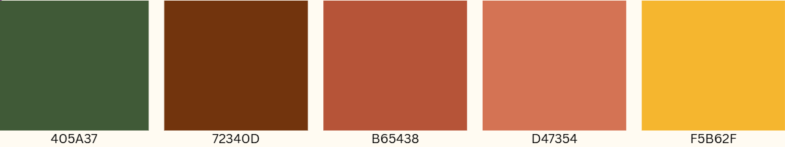

# 🌵 Pindorama

Aplicação web para difundir conteúdos sobre o Patrimônio Cultural Imaterial Brasileiro.

## Requisitos funcionais

### Administrador

- CRUD de artigos e eventos
- Criar rascunhos
- Personalizar site em datas comemorativas
- Destacar eventos e datas especiais

### Usuário

- Acessibilidade
- Visualizar conteúdos
- Busca e filtros
- Interação via mapa do Brasil

## Requisitos não funcionais

- Conteúdo centralizado e acessível
- Interface simples e intuitiva
- Fácil atualização pelo administrador
- Escalabilidade para novas funções
- Textos claros, fontes legíveis e contraste adequado
- Informações resumidas
- Carregamento rápido
- Responsividade

## Stack utilizada

**Front-end:** React, Sass, Framer Motion

**Back-end:** Ruby, Python, PostgreSQL

## Paleta de cores



## Instalação

Clone o projeto

```bash
  git clone https://github.com/Debora-Carvalho/sistema-web-pindorama.git
```

Entre no diretório do projeto

```bash
  cd sistema-web-pindorama
```

Instale as dependências

```bash
  npm install
```

Inicie o servidor

```bash
  npm run dev
```

## Licença

Este projeto está protegido. Para mais detalhes, consulte o arquivo [LICENSE](LICENSE.txt) na raiz do repositório.

## Desenvolvedoras

<div style="display: flex; flex-direction: row; align-items: center; justify-content: start; gap: 20px;">
  <div style="text-align: center;">
    <a href="https://github.com/Amanda-Brit0" target="_blank">
      
      <br>
      <sub>Amanda Brito</sub>
    </a>
  </div>

  <div style="text-align: center;">
    <a href="https://github.com/AnahiMamani" target="_blank">
      
      <br>
      <sub>Anahi Narieli</sub>
    </a>
  </div>

  <div style="text-align: center;">
    <a href="https://github.com/Debora-Carvalho" target="_blank">
      
      <br>
      <sub>Débora Carvalho</sub>
    </a>
  </div>

  <div style="text-align: center;">
    <a href="https://github.com/IsabellaSGoncalves" target="_blank">
      
      <br>
      <sub>Isabella Gonçalves</sub>
    </a>
  </div>

  <div style="text-align: center;">
    <a href="https://github.com/BONJIU" target="_blank">
      
      <br>
      <sub>Julia Bongiovani</sub>
    </a>
  </div>

  <div style="text-align: center;">
    <a href="https://github.com/LunaLeao" target="_blank">
      
      <br>
      <sub>Luna Leão</sub>
    </a>
  </div>
</div>

<br><br>

📅 Última atualização: Set/2025
